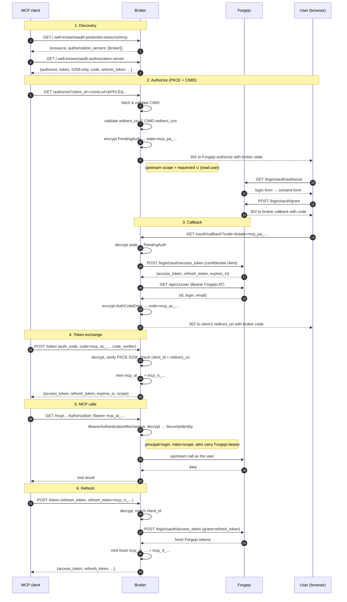

# Auth flow

Design rationale for the broker's OAuth setup. Package layout and file names
are in `CLAUDE.md`; phased build status is in `PLAN.md`.

## What the broker is

A Quarkus app that sits between an MCP client (Claude) and a Forgejo
instance.

To Forgejo it is one confidential OAuth client. The operator registers a
single OAuth app on Forgejo and supplies `client_id` and `client_secret` as
env vars. All end users of this deployment share that app.

To the MCP client it is an OAuth Authorization Server. It publishes
`/.well-known/oauth-authorization-server` and
`/.well-known/oauth-protected-resource/mcp`. Downstream clients are
identified by Client ID Metadata Documents (CIMD); there is no Dynamic
Client Registration.

## Why a broker instead of a pass-through

Forgejo speaks OAuth 2.0 with a REST `/api/v1/user` for identity. It is not
an OIDC provider: no `/.well-known/openid-configuration`, no ID tokens, no
JWKS, no DCR.

The MCP authorization spec requires the resource server to advertise an
Authorization Server with discovery metadata and PKCE. It does not require
that AS to be the upstream identity provider. Running our own AS in the
middle lets us:

- present the metadata the MCP spec wants without bolting OIDC onto Forgejo;
- decide what scopes to ask Forgejo for, independently of what the downstream
  client requested (the broker always adds `read:user` upstream so it can
  resolve the authenticated user);
- keep the Forgejo `client_secret` server-side and never expose Forgejo's
  token shape to the downstream.

The AS is built into this app rather than delegated to an external service
like Keycloak. The deployment story for this project is one container per
Forgejo instance: the operator runs the MCP server image and points it at
Forgejo. Adding an external auth server would make that two services to
deploy, configure, and keep in sync.

## Stateless envelope tokens

Every token the broker hands out is an AES-256-GCM envelope. The plaintext
is a record with everything needed to honour the next step: embedded Forgejo
tokens, resolved user, scope, expiry. There is no server-side store.

Format: `<prefix><base64url(nonce(12) || ciphertext+tag(16))>`. The prefix
names the token kind (`mcp_at_`, `mcp_rt_`, `mcp_ac_`, `mcp_pa_`) and is
bound as AEAD additional data, so a token of one kind cannot be decrypted as
another even under the same key. Expiry is checked after decrypt. The code
lives in `broker/crypto/TokenCrypto`. The key comes from
`BROKER_TOKEN_ENCRYPTION_KEY`.

With no store, one container per Forgejo instance is the whole deployment.
Multiple broker replicas behind a load balancer share the key and can
decrypt each other's tokens.

The tradeoffs:

- No server-side revocation. A token stays valid until it expires. Rotating
  `BROKER_TOKEN_ENCRYPTION_KEY` is the only way to invalidate everything at
  once.
- Auth codes and refresh tokens are replayable within their TTL. The
  auth-code TTL defaults to 60 seconds to keep the replay window small.
- No introspection or audit trail of issued tokens.

These are acceptable for the deployment model in `README.md`, which is
internal-network. If that changes, the stateless choice is the first thing
to revisit.

## CIMD instead of DCR

A downstream client's `client_id` is a URL. The broker fetches the URL,
validates the JSON document at the other end, and uses its declared
`redirect_uris` as the allowlist for that client. The shape of the document
comes from the MCP CIMD draft.

DCR (RFC 7591) is not implemented. If a non-Claude MCP host needs it later,
the broker can grow a `/register` endpoint and a small store.

## The full flow

Token kinds:

| Prefix | Type | Lifetime | Carries |
|---|---|---|---|
| `mcp_pa_` | PendingAuth — used as Forgejo `state=` | minutes | client_id, redirect_uri, mcp state, PKCE challenge, requested scope |
| `mcp_ac_` | Broker auth code — returned to the client after callback | seconds | client_id, redirect_uri, PKCE challenge, scope, Forgejo tokens, Forgejo user |
| `mcp_at_` | Broker access token — Bearer for `/mcp/*` | broker AT TTL, capped by Forgejo AT | client_id, scope, Forgejo tokens, Forgejo user |
| `mcp_rt_` | Broker refresh token | days | client_id, scope, Forgejo tokens, Forgejo user |

## Why not `quarkus-oidc-proxy`

The Quarkiverse `quarkus-oidc-proxy` extension solves a related problem but
not this one. It builds on `quarkus-oidc`, which requires an OIDC upstream
(`/.well-known/openid-configuration`, ID tokens, JWKS). Forgejo doesn't have
those, so the OIDC layer underneath the proxy doesn't fit.

The proxy also bridges DCR for downstream clients. This broker uses CIMD
instead — the `client_id` is a URL and there is no registration step.

`quarkus-oidc-proxy` is the right tool when the upstream is Keycloak or
Auth0 and downstream clients want DCR.

## Where the code lives

| Concern | Class |
|---|---|
| Discovery metadata, `/authorize`, `/oauth/callback`, `/token` | `broker/endpoint/OAuthResource` |
| Bearer auth on `/mcp/*` → SecurityIdentity | `broker/security/BearerAuthenticationMechanism` |
| Envelope mint and parse | `broker/crypto/TokenCrypto` |
| CIMD fetch and validation | `broker/service/CimdResolver` |
| Forgejo OAuth REST client | `broker/forgejo/ForgejoOAuthApi` + `broker/service/ForgejoOAuthClient` |
| Sealed exception hierarchy → JAX-RS responses | `broker/model/BrokerException` + `broker/endpoint/BrokerExceptionMapper` |

The leaf-package rule in `CLAUDE.md` is checked by `PackageLayoutTest`.
